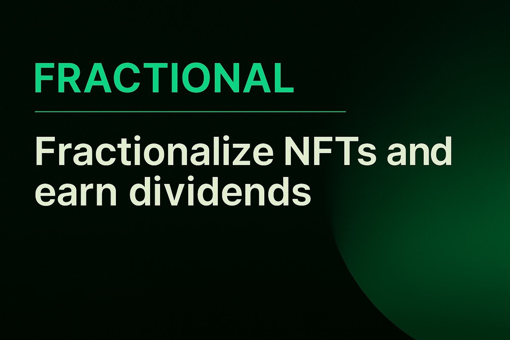

# Fractional

<p align="center">
  
</p>

<p align="center">
  <strong>Tokenise, fractionalise, and reward asset ownership on the Hedera testnet.</strong>
</p>

---

## Table of Contents

1. [Overview](#overview)
2. [Highlights](#highlights)
3. [Architecture](#architecture)
4. [Tech Stack](#tech-stack)
5. [Repository Structure](#repository-structure)
6. [Prerequisites](#prerequisites)
7. [Environment Configuration](#environment-configuration)
8. [Run Locally](#run-locally)
9. [Smart Contracts](#smart-contracts)
10. [Core Flows](#core-flows)
11. [Quality Gates](#quality-gates)
12. [Deployment](#deployment)
13. [Troubleshooting](#troubleshooting)
14. [Roadmap](#roadmap)
15. [Team & Credits](#team--credits)

---

## Overview

Fractional is our hackathon submission showcasing a full-stack Web3 experience on **Hedera**.  
Creators can mint asset NFTs, issue fractional FT shares, deploy a rewards contract, and manage payouts – all in one workflow.  
Investors associate tokens and claim dividends directly from their wallets.

🎯 **Mission:** unlock liquidity for real-world and in-game assets through community co-ownership.

---

## Highlights

- ⚡️ **Single-click fractionalisation** – NFT + FT minting, smart-contract deployment, registry persistence.
- 🔐 **Wallet-first UX** – HashPack integration via HashConnect (extension & WalletConnect v2).
- 💸 **On-chain rewards** – DividendDistributor contract handles HBAR deposits and proportional claims.
- 🧩 **Serverless-friendly backend** – Next.js App Router APIs; Hedera File Service (HFS) replaces a traditional database.
- 🌐 **Portable metadata** – IPFS (Pinata) + HFS mirroring for redundant asset metadata.
- 🚀 **Ready for Vercel & AWS Amplify** – build scripts copy smart-contract artifacts; deterministic build IDs avoid cache drift.

---

## Architecture

```
┌────────────────────────────────────────────────────┐
│               Next.js Frontend & APIs              │
│  • App Router pages (landing, assets, portfolio)   │
│  • API routes for Hedera interactions              │
│  • HashConnect client + wallet flows               │
└────────────┬───────────────────────────────────────┘
             │
             ▼
┌────────────────────────────────────────────────────┐
│           Hedera Services & Smart Contracts        │
│  • Token Service (NFT + FT minting)                │
│  • DividendDistributor contract (rewards)          │
│  • Hedera File Service (asset registry + metadata) │
│  • Mirror Node (read-only account/token data)      │
└────────────┬───────────────────────────────────────┘
             │
             ▼
┌────────────────────────────────────────────────────┐
│                Supporting Infrastructure           │
│  • Pinata IPFS uploads                             │
│  • WalletConnect Cloud (optional)                  │
│  • Vercel / AWS Amplify for hosting                │
└────────────────────────────────────────────────────┘
```

---

## Tech Stack

| Layer            | Tools |
| ---------------- | ----- |
| Frontend / APIs  | Next.js 14 (App Router), React 18, Tailwind CSS, TypeScript |
| Wallet           | HashConnect SDK, HashPack, WalletConnect v2 |
| Hedera tooling   | @hashgraph/sdk, ethers v6 |
| Smart Contracts  | Solidity (Hardhat build outputs) |
| Storage          | Hedera File Service, Pinata IPFS |
| Deployment       | Vercel, AWS Amplify |

---

## Repository Structure

```
fractional-fullstack/
├── fullstack/                # Next.js app
│   ├── app/                  # Pages & API routes
│   ├── components/           # UI + wallet helpers
│   ├── lib/                  # Hedera utilities, registry logic
│   ├── scripts/              # Build helpers (copy artifacts, etc.)
│   ├── public/               # Static assets (fractional.png, logo.png, artifacts during build)
│   ├── amplify.yml           # AWS Amplify build spec
│   └── tailwind.config.ts    # Theme configuration
├── smart contract/           # Solidity sources + Hardhat artifacts
│   ├── contracts/
│   └── artifacts/
└── README.md                 # This document
```

---

## Prerequisites

- Node.js **18.17+**
- npm (lockfile included)  
- Hedera testnet account with HBAR (`OPERATOR_ID`, `OPERATOR_KEY`)  
- Pinata JWT (`pinJSONToIPFS` scope)  
- HashPack wallet (desktop extension)  
- (Optional) WalletConnect Project ID for mobile pairing  
- (Optional) Hardhat (if recompiling contracts)

---

## Environment Configuration

Create `fullstack/.env.local` (local dev) and configure production environments with the same values.

| Variable | Description |
| --- | --- |
| `OPERATOR_ID` | Hedera account ID used as treasury + operator |
| `OPERATOR_KEY` | Private key for the operator account |
| `OPERATOR_EVM_KEY` | Optional 64-byte ECDSA key for ethers deployment (falls back to `OPERATOR_KEY`) |
| `PINATA_JWT` / `PINATA_JWT_FILE` | Pinata JWT or file path for IPFS uploads |
| `APP_URL` / `NEXT_PUBLIC_APP_URL` | Public base URL for server/client rendering |
| `HEDERA_NETWORK` / `NEXT_PUBLIC_HEDERA_NETWORK` | `testnet` (default) or `previewnet` / `mainnet` |
| `MIRROR_NODE_URL` | Custom Mirror Node endpoint (defaults to Hedera public testnet) |
| `NEXT_PUBLIC_WALLETCONNECT_PROJECT_ID` / `NEXT_PUBLIC_WC_RELAY_URL` | WalletConnect configuration (optional) |
| `SMART_CONTRACT_ARTIFACT_DIR` | Path to compiled artifacts (`../smart contract/artifacts` locally, `public/__artifacts` on Vercel) |
| `SMART_CONTRACT_ARTIFACT_ROOT`, `APP_ROOT` | Optional hints for artifact discovery on constrained hosts |
| `ASSET_REGISTRY_FILE_ID` | (Optional) HFS file ID for the asset registry. Leave blank to auto-create/log. |

> When `ASSET_REGISTRY_FILE_ID` is empty, the API writes a new registry file to HFS and logs the ID. Persist it for future deployments.

---

## Run Locally

```bash
git clone <repo-url>
cd fractional-fullstack/fullstack
npm install
cp .env.local.example .env.local   # then edit with your credentials
npm run dev
```

- Visit `http://localhost:3000`
- Connect HashPack (extension) or use WalletConnect for mobile
- Create an asset to mint NFT + FT, deploy the distributor, and populate the registry

---

## Smart Contracts

| Contract | Purpose |
| --- | --- |
| `FractionalFactory.sol` | Orchestrates NFT + FT minting and ownership setup |
| `DividendDistributor.sol` | Tracks supply and distributes HBAR rewards to token holders |

Artifacts live in `smart contract/artifacts`. The Next.js app expects these during deployment; the `copy-artifacts.mjs` script ensures they are bundled (e.g., into `public/__artifacts` for Vercel).

To rebuild the contracts:

```bash
cd smart\ contract
npm install         # first time
npx hardhat compile
```

Commit the updated `artifacts/` directory so the dApp loads the latest ABIs/bytecode.

---

## Core Flows

### Mint & Fractionalise

1. Fill in asset details on the **Create** page.
2. Backend uploads metadata to Pinata + HFS, mints NFT + FT, deploys the DividendDistributor, associates FT with contract, transfers NFT to creator, leaves FT supply in operator treasury, and records the asset in the HFS registry.

### Fractionalise Existing NFT

Use `/fractionalize` to wrap a wallet-owned NFT into fractions managed by the distributor contract.

### Buy Shares

1. Asset page checks token association; if missing, composes a TokenAssociate transaction for the wallet.
2. Buy flow is currently demo-mode: treasury transfer is stubbed (operator retains supply). Ideal for presentation without moving treasury tokens.

### Rewards

- **Deposit:** `/api/rewards/deposit` streams HBAR into the distributor contract.
- **Claim:** `/api/rewards/claim` composes a claim transaction for the user to sign and submit.

---

## Quality Gates

```bash
cd fullstack
npm run lint    # ESLint
npm run build   # Production build + artifact copy
```

`npm start` (after `npm run build`) launches the production server locally.

---

## Deployment

### Vercel

1. Set project root to `fullstack/`.
2. Add environment variables (see table).  
   - Set `SMART_CONTRACT_ARTIFACT_DIR=public/__artifacts`.  
   - Build command `npm run build` already copies artifacts (`node scripts/copy-artifacts.mjs && next build`).
3. Redeploy. The API will reuse the registry file (or create one if absent).

### AWS Amplify

1. Connect repo, choose `fullstack` as app root.
2. The included `amplify.yml` handles dependency install, artifact copy (`../smart contract/artifacts` → `smart-contract/artifacts`), and `npm run build`.
3. Configure env vars: `OPERATOR_ID`, `OPERATOR_KEY`, `PINATA_JWT`, `SMART_CONTRACT_ARTIFACT_DIR=smart-contract/artifacts`, plus wallet/URL variables.
4. Trigger build → test asset creation, association, and claim flows.

### Other Providers

Ensure the smart-contract artifacts are copied into the deployed bundle and configure `SMART_CONTRACT_ARTIFACT_DIR` accordingly.

---

## Troubleshooting

| Problem | Suggestion |
| --- | --- |
| `/assets` empty in production | Verify `ASSET_REGISTRY_FILE_ID` and registry read access. The app falls back to HFS if the mirror fails. |
| Pinata upload errors | Double-check `PINATA_JWT` scope or set `PINATA_JWT_FILE`. |
| WalletConnect failures | Provide `NEXT_PUBLIC_WALLETCONNECT_PROJECT_ID` or rely on HashPack extension only. |
| `INVALID_SIGNATURE` during deploy | Use ECDSA keys (set `OPERATOR_EVM_KEY` if `OPERATOR_KEY` is ED25519). |
| Missing artifacts | Run `npm run build` locally to confirm `public/__artifacts` is populated. Ensure hosting env copies artifacts. |
| Registry lost after redeploy | Copy the logged `ASSET_REGISTRY_FILE_ID` into environment variables to keep the same HFS file. |

---

## Roadmap

- Reinstate treasury-to-user FT transfers with allowance checks once the operator holds supply.
- Add DAO-style governance per asset (voting, proposals).
- Expand to additional reward tokens beyond HBAR.
- Ship analytics dashboards and coverage tests.
- Prepare mainnet deployment scripts and key rotation tooling.

---

## Team & Credits

- Built by the Fractional team for the Hedera Hackathon.  
- Wallet integration powered by [HashConnect](https://github.com/hashgraph/hashconnect) and [HashPack](https://hashpack.app/).  
- Thanks to the Hedera community, Pinata, Vercel, and AWS Amplify for the infrastructure.

<p align="center">
  
  <br>
  <em>Happy fractionalising! 🚀</em>
</p>
